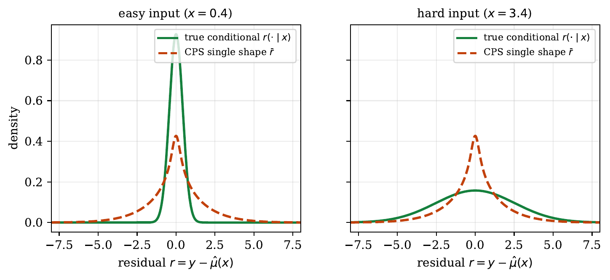
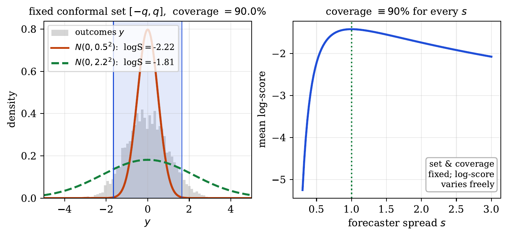
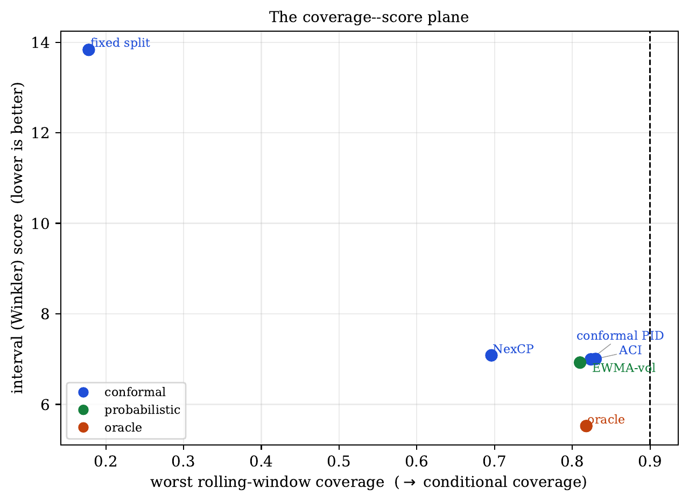
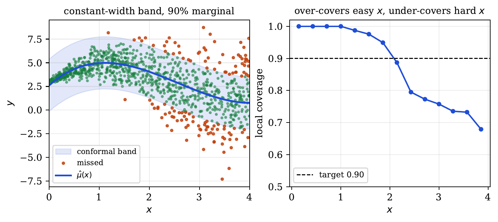
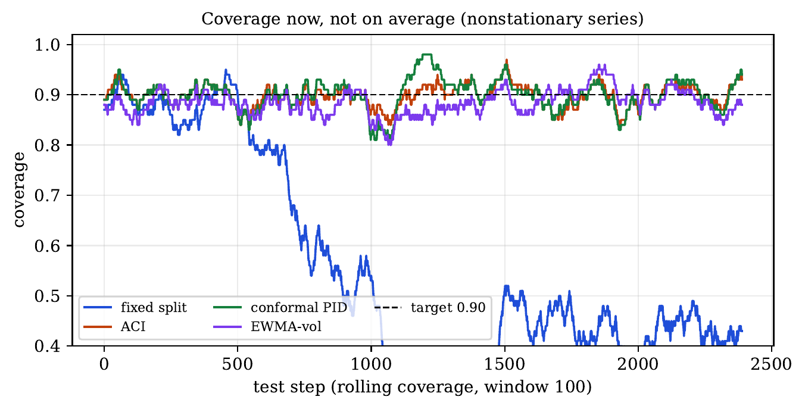

# Conformal Prediction Provides a Strict Guarantee ... That You'll Lose Money Leaning on It

*What conformal prediction actually computes — and why a hardwired rule on the order statistics of your residuals was never going to substitute for modeling.*

---

I created [ConformalPrediction.net](https://conformalprediction.net) as a practical, interactive guide. But it is built on one premise: to wield conformal prediction well, you have to understand what it isn’t. You will be relieved that this is not a marketing site. I am sure as hell not trying to sell you a one hundred dollar pdf for "professional conformal prediction".

Strip the marketing away and ask what split conformal prediction actually computes. You have a point predictor μ̂, a pile of calibration residuals `r = y − μ̂(x)`, and a miscoverage level α. The recipe takes the **order statistics** of the absolute residuals and reads off the ⌈(n+1)(1−α)⌉-th one. That number is the half-width of every interval you emit. Add it, subtract it, done.

That is the whole machine. It is a sorted list and an index into it. It does not look at the input `x` when it picks the width — it *cannot*, by construction; the width is one scalar reused for every test point. It is, in the most literal sense, a hardwired rule on the empirical distribution of residuals.

So here is the common-sense objection, stated plainly: **a fixed rule on the order statistics of residuals cannot substitute for modeling.** It was never going to. You did not feed it anything about where the uncertainty is large and where it is small, so it cannot tell you. You handed it one number to cover everywhere, and it dutifully returns one number that covers everywhere — on average. Expecting that step to sharpen your forecast is expecting a thermometer to lower the fever. Actually it is worse because at least a thermometer tries to measure your temperature whereas conformal prediction is shockingly indifferent to the thing you *usually* care about (say a proper scoring rule). 

> *Try it yourself: [how split conformal works](https://conformalprediction.net/demos/01-how-conformal-works.html) — move the slider and watch coverage track 1−α exactly, with one width for the whole input space.*

## A skeptical prior

I am very late to the conformal prediction game because something didn't smell right to me. I'm not new to distribution-free claims and remember well conversations with Tom Cover about universal portfolios - a clever insight for sure but also not one I've ever been able to use profitably. In that instance the goalpost was asymptotic regret relative to the best hindsight portfolio, and, well, do you *really* care about that? What if I know something, even vaguely, about the distribution of my returns — are you saying I cannot use that? 

Conformal prediction is a different type of goalpost game, sure, but I was reluctant to invest mental energy in understanding what the fuss was about because, once again, it is a priori implausible to me that relatively simple observations (say about order statistics of residuals) can possibly guarantee anything *useful*. Sure it is no doubt possible to guarantee *something*, but would that something actually improve performance in a way you care about, or in a way that wouldn't already be built into a (sensible) forecast procedure?  

I finally caved in and decided to try to *understand* conformal prediction. I'm the first to admit I'm new to this field and I don't claim to be an expert. I chose TMLR because of the double blind review to hide my inexperience. But as an aside, what does “expert” possibly mean in this context if the key insight in the field of conformal prediction is within a whisker of the very definition of a cumulative distribution function? We are *not* going to make this a discussion that labors under the classic fallacy of authority!  

My [paper](https://conformalprediction.net/paper/) is a mathematical identity. It makes clear the limitation of conformal prediction in a way that, to my knowledge, has not been done before. The theorem is not deep. It has close analogies that are well known (calibration and sharpness are different challenges), yet I believe it is a novel perspective. I guess one only needs a fairly simple theorem in order to pop the bubble of conformal prediction because the key conformal prediction idea is itself trivial. 

Too harsh?

## What “cannot substitute” for modeling means, exactly

Fix the location predictor and grade the resulting predictive distribution with a proper score (use the log-score for the clean version). The regret of the single-shape conformal system against the conditional oracle is *exactly* the mutual information **I(R;X)** between the residual and the input. That is the information about the spread that lives in `x` and that an `x`-blind rule throws away on purpose.

Conformalizing **cannot reduce that quantity**. No re-leveling that ignores `x` can, because the gap is a property of the shape class you chose, not of your calibration. Conformal prediction re-levels coverage beautifully and exactly. It moves the coverage coordinate and only the coverage coordinate. The sharpness coordinate — the one a proper score actually grades — it does not touch.

> *Slide the [coverage-vs-log-score demo](https://conformalprediction.net/demos/04-coverage-vs-logscore.html) and watch the score sit still while coverage snaps to target.*

So “not a substitute for modeling” is not a vibe. It is a conservation law. If you want the spread to follow `x`, you have to put it there yourself, upstream, before the certificate goes on.

## The gap has five faces

Conformal prediction fans will be livid. They will say I don't understand conformal prediction. I say: are you sure you understand modeling, or betting, or investing, or information? How often do you put your money on the line? So let's look at `I(R;X)`, the information gap. It is literally what conformal prediction tries and fails to sweep under the rug. I give you five ways to see the folly. 

`I(R;X)` is one number, but it pays to turn it over in your hand — each face hides what the others show. (I built a [live version](https://conformalprediction.net/demos/14-four-readings.html) where one slider moves all of them at once.)

**1 — The cost of pretending everyone is the same.** A single-shape forecaster makes a quiet claim: once I have made my point prediction, the leftover error looks the same for every input — same spread for the easy cases and the hard ones. That is almost never true. Some inputs are noisy, some are calm. The gap is the bill for ironing them all flat into one average shape `r̄`. In symbols, `I(R;X) = E_x KL( r(·|x) ‖ r̄ )`: averaged over inputs, how far each input’s true error law sits from the pooled one.

**2 — An average log Bayes factor.** Take a single observation and ask: how much more likely was this residual under its true, `x`-specific law than under the pooled one? Log that ratio and you have a little vote for “the input mattered.” Most single votes are small; average them and you get the gap. `I(R;X) = E log[ r(R|x) / r̄(R) ]` — the oracle’s expected edge per data point, stated as evidence.

**3 — The conformal ranks are not as uniform as they look.** Conformal’s party trick is the PIT: it makes the rank `U = G(R)` come out uniform, so the histogram is a tidy flat bar. True — *marginally*. Split that same picture by input and the flatness evaporates. Easy inputs bunch their ranks near ½ (over-cautious there); hard inputs shove them to the tails (under-cautious). The flat bar was an average of lumpy conditional ones, and the size of that hidden lumpiness is, again, the gap.

**4 — How far your world is from independence.** `I(R;X)` is, by definition, the KL distance from the real joint law of (input, residual) to the nearest world in which the two are independent. A single-shape model *lives* in that independent world — `R ⊥ X` is its founding assumption. So the gap is just the distance from where you are standing to where the truth actually is, and no amount of `x`-blind fiddling walks you across it. Re-leveling shuffles you around inside the independent world; it never leaves it.

**5 — It is the rent.** Here is the face I like best, and it may be the most honest. In a fair parimutuel — equivalently, betting Kelly — a player who knows the true distribution `P`, wagering into a crowd that prices with some other `Q`, compounds wealth at a rate of exactly `KL(P ‖ Q)` per round. The informed player’s edge is not vague hand-waving; it is a divergence, in nats. (This is the heart of what I once called [the lottery paradox](https://www.youtube.com/watch?v=13IgveD2IN4): the rent an informed bettor extracts from the misinformed is KL, full stop.)

Now point that lens at conformal prediction. The single-shape forecaster *is* the crowd — it prices every input with the same pooled residual law `r̄`. The oracle knows the conditional law `r(·|x)`. The rent the oracle collects from the conformal forecaster, per observation, is `KL( r(·|x) ‖ r̄ )` — and averaged over inputs, that is `I(R;X)`, on the nose.

So the gap is not an abstraction you can wave away. It is money. Each nat is a Kelly growth rate; divide by `ln 2` and it is how many times the informed forecaster doubles its bankroll relative to yours, per observation. And here is the kicker — the thing this whole piece is about — conformalizing changes the *overround*, the coverage level, the house’s cut. It cannot change the rent, because the rent is a KL defined by conditioning on `x`, and re-leveling refuses to look at `x`. You can make the book balance to 90%. You cannot stop the informed party collecting. That is “conformal can’t substitute for modeling,” with a price tag attached.

It helps to think in two coordinates rather than one. Coverage is a leveling you can always repair for free. Sharpness is the part you have to earn by modeling. A single number — “95% coverage!” — hides the coordinate that actually carries the information.

> *The [coverage–score plane demo](https://conformalprediction.net/demos/13-coverage-score-plane.html) makes the two axes movable independently.*

## “But the modern methods are sharp!”

They are. Conformalized quantile regression, Mondrian and CRPS-binned predictive systems, conformal training — these produce genuinely sharp, shape-adaptive distributions, and they are standard practice now, not exotica. None of this contradicts the point above; it *is* the point above.

Look at where the sharpness comes from in each one. CQR fits a quantile model — that is the modeling. Mondrian fits a separate residual law per region — modeling. The CRPS-binned version *chooses the bins by minimizing a proper score* — that is conditional density estimation wearing a conformal hat. Conformal training differentiates through the conformalizer to minimize set size — an objective, optimized. In every case the work that buys the sharpness is the conditioning on `x`. The conformal step at the end supplies the coverage guarantee, which is real and worth having, and nothing else.

> *See it directly: [marginal vs conditional coverage](https://conformalprediction.net/demos/02-marginal-vs-conditional.html).*

Which is why I think the framing of these as “improvements to conformal prediction” is half a category error. They are improvements to the *model* that happen to end with a conformal certificate. The certificate is the same order-statistic trick it always was. Calling the modeling “conformal” because it ships with a conformal wrapper is like calling the engine “the warranty.” And attributing the benefit of modeling to the conformal accounting is like giving Heinz credit for a red Tesla.  

## On moving the goalposts

The time-series story is the same shape. Drop exchangeability and the finite-sample guarantee is gone, so the literature re-defines what is guaranteed: marginal coverage becomes a *long-run, time-average* miscoverage frequency (ACI), or a regret bound over local intervals (online conformal under arbitrary shift). These are ingenious, and — this matters — long-run frequency control under drift is a genuine, hard-won engineering guarantee. Often it is the most you can ask for without a model of the shift.

But notice it is a *weaker, differently posed* object than the thing you usually want, which is a sharp predictive distribution *now*, for *this* step. Trading “covered here” for “covered 95% of the time on average over the run” is a fine trade when the application genuinely demands a coverage certificate. It is not a fine trade when you talked yourself into it because the original guarantee evaporated and the word “conformal” was too good to give up. Redefine the goalposts when the application moves them — not to keep the brand.

> *Watch the regime change break exchangeability: [exchangeability and time series](https://conformalprediction.net/demos/05-exchangeability-timeseries.html).*

Is there any reason to think a conformal approach (a misnomer in my view) is better than "just modeling"? Not in my view. The so-called extensions to the original (pretty dumb) conformal approach are just rules or models that are sometimes a good choice and often not. They certainly do not replace careful modeling or for that matter, prediction markets. For example, the very first simple model I pulled off my old shelf scored better than the so-called SOTA conformal prediction methods. You can see the comparison on the site, or just try yourself. 

## When it is exactly the right tool

None of this is anti-conformal, to those who actually understand what conformal prediction entails (as I now half claim to). There is a clean set of jobs where coverage or containment *is* the product, and there the distribution-free, finite-sample guarantee is exactly the value added:

- **Anomaly and novelty detection** via conformal *p*-values — conformal prediction’s most natural home, where it is a distribution-free hypothesis test and coverage *is* Type-I error control. *([demo](https://conformalprediction.net/demos/10-anomaly-pvalues.html))*
- **Compliance and SLAs**, where “contained 95% of the time” is literally the deliverable. *([safety envelope demo](https://conformalprediction.net/demos/12-safety-envelope.html))*
- **Retrieval and shortlisting**, where the product is a candidate set and coverage is recall. *([guaranteed recall demo](https://conformalprediction.net/demos/11-guaranteed-recall.html))*
- **Selective prediction / risk control**, where you abstain to hold an error rate.

In all of these you wanted a set with a guarantee, not a sharp density. Use the tool that delivers exactly that, and stop apologizing for it. I learned (finally) of the *real* uses of conformal guarantees and I've made a real effort to show you some. They just happen to be outside my field: distributional prediction. 

## The one-line version

Conformal prediction is an order statistic of your residuals: a coverage certificate, not a forecast. To say it has been oversold as a silver bullet is really too kind in some instances because it **mathematically** cannot do that. It is certainly not a “better way” to do uncertainty, and not a substitute for the modeling you skipped. So: **model first, conformalize last.** If a proper score does not move after you conformalize, that is not a disappointment — it is the theorem confirming your gains came from the model, exactly where they should.

---

*The careful version of this argument, with proofs, citations, and a numerical check of the I(R;X) identity, is in the [companion paper](https://conformalprediction.net/paper/). Thirteen interactive demonstrations are at [conformalprediction.net](https://conformalprediction.net).*
